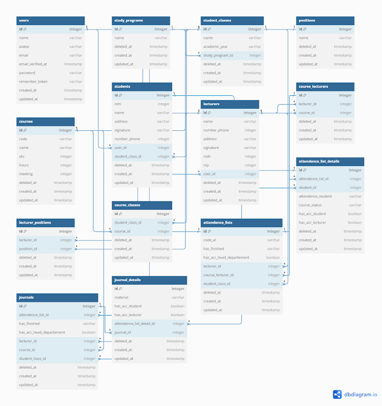
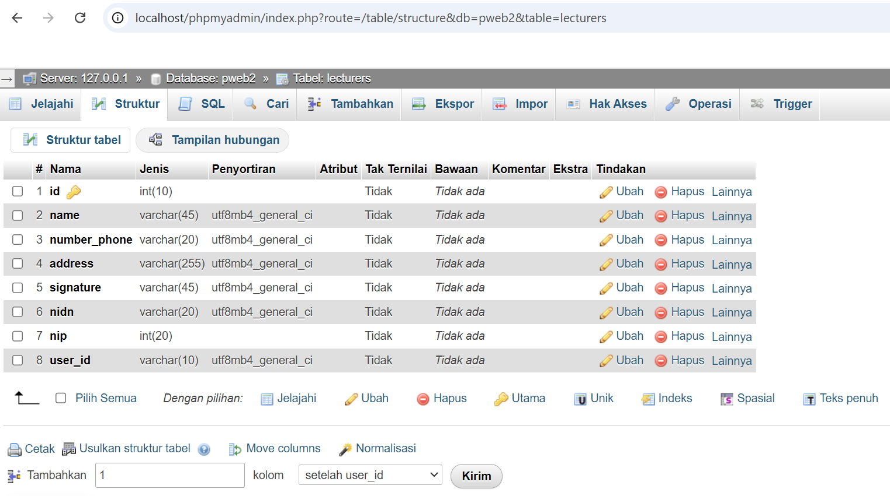
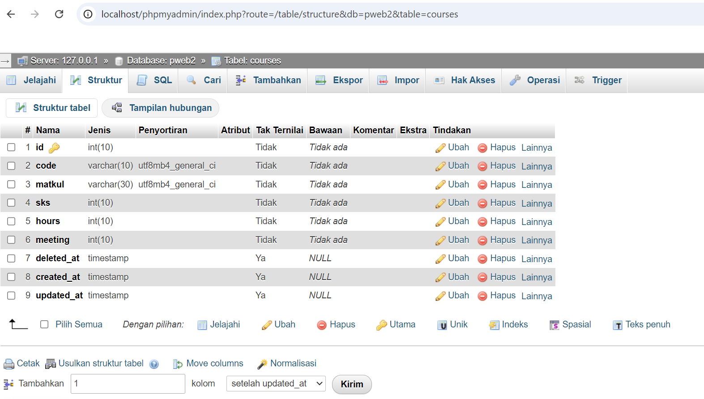
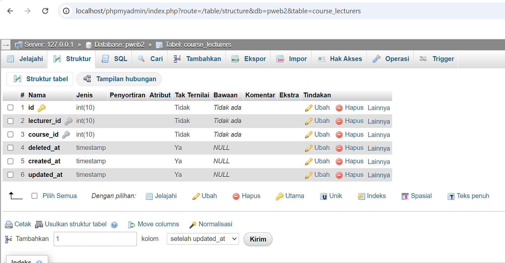

# PWEB2-Tugas2
Repository ini dibuat untuk memenuhi tugas mata kuliah praktikum pemrograman web II.
## Implemented Object-Oriented Programming (OOP)
Sistem Informasi Perkuliahan JKB adalah sistem manajemen akademik yang komprehensif yang dirancang untuk mempermudah proses pengelolaan kehadiran perkuliahan, jurnal, dan data akademik lainnya di institusi pendidikan tinggi.
### Entity-Relationship Diagram (ERD)

Pada implementasi OOP kali ini menggunakan tabel yaitu tabel lecturers, courses dan course_lecturers yang saling berhubungan. Manajemen ini dibuat dengan mengimplementasikan konsep-konsep OOP untuk mengtur data agar lebih terstruktur.
1. **Tabel lecturers** adalah tabel yang menyimpan data tentang dosen/pengajar, dengan adanya data ini lebih mudah saat ingin mencari data mengenai dosen.
2.  **Tabel Courses** berisi data mata kuliah yang ada, informasi ini dapat membantu menyusun dan mengatur jadwal perkuliahan.
3.  **Tabel Course_lecturers** menghubungkan tabel lecturers dan courses serta memberikan gambaran lengkap penjadwalan mata kuliah dan dosen pengajarnya.
#### Membuat database dan tabel

Dalam tabel _lecturer_ terdapat beberapa atribut yaitu id sebagai primary key, name, number_phone, signature, nidn, nip, dan user_id.

Dalam tabel _Courses_ terdapat atribut id sebagai primary key, code mata kuliah, sks, hours, meeting ata berapa kali pertemuan delete,creted,updeted data untuk mengelola data.

Tabel _course_lecture_ adalah tabel yang digunakan untuk menghubungkan kedeua tabel tersebut lecture_id sebagai forgein key yang menghubungkan dengan table lecture dan course_id forgein key yang menghubuhngkan dengan tabel course.

