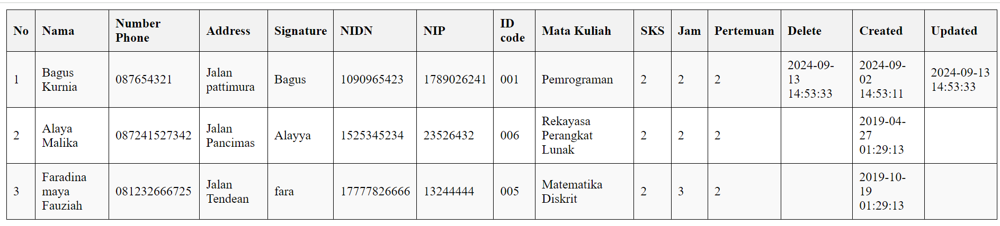
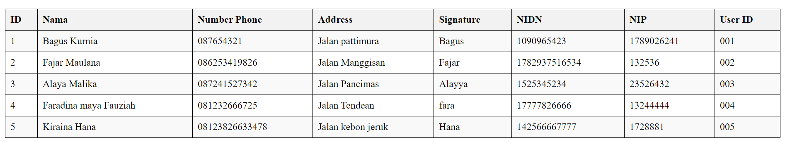
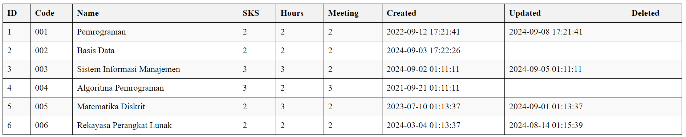

# PWEB2-Tugas2
Repository ini dibuat untuk memenuhi tugas mata kuliah praktikum pemrograman web II.
## Implemented Object-Oriented Programming (OOP)
Sistem Informasi Perkuliahan JKB adalah sistem manajemen akademik yang komprehensif yang dirancang untuk mempermudah proses pengelolaan kehadiran perkuliahan, jurnal, dan data akademik lainnya di institusi pendidikan tinggi.
### Entity-Relationship Diagram (ERD)

Pada implementasi OOP kali ini menggunakan tabel yaitu tabel lecturers, courses dan course_lecturers yang saling berhubungan. Manajemen ini dibuat dengan mengimplementasikan konsep-konsep OOP untuk mengtur data agar lebih terstruktur.
1. **Tabel lecturers** adalah tabel yang menyimpan data tentang dosen/pengajar, dengan adanya data ini lebih mudah saat ingin mencari data mengenai dosen.
2.  **Tabel Courses** berisi data mata kuliah yang ada, informasi ini dapat membantu menyusun dan mengatur jadwal perkuliahan.
3.  **Tabel Course_lecturers** menghubungkan tabel lecturers dan courses serta memberikan gambaran lengkap penjadwalan mata kuliah dan dosen pengajarnya.
### Membuat database dan tabel

Dalam tabel _lecturer_ terdapat beberapa atribut yaitu id sebagai primary key, name, number_phone, signature, nidn, nip, dan user_id.

Dalam tabel _Courses_ terdapat atribut id sebagai primary key, code mata kuliah, sks, hours, meeting ata berapa kali pertemuan delete,creted,updeted data untuk mengelola data.

Tabel _course_lecture_ adalah tabel yang digunakan untuk menghubungkan kedeua tabel tersebut lecture_id sebagai forgein key yang menghubungkan dengan table lecture dan course_id forgein key yang menghubuhngkan dengan tabel course.
### Membuat koneksi dengan database
```php
class database
{
  private $host = "localhost";
  private $username = "root";
  private $password = "";
  private $database = "PWEB2";
  private $koneksi;

  function __construct()
  {
    $this->koneksi = mysqli_connect($this->host, $this->username, $this->password, $this->database);
    if (mysqli_connect_errno()) {
      die("koneksi database gagal: " . mysqli_connect_error());
    }
  }
  protected function query($sql)
  {
    return mysqli_query($this->koneksi, $sql);
  }
  function tampil() {}
}
```
Dengan code diatas kita dapat terhubung dengan database. Database dengan diberi nama PWEV2 beserta atributnya yang bersifat private dengan mengimplementasikan konsep encapsulation. dalam class ini juga terdapat metode _tampil()_ yang nantinya kelas ini akan menjadi kelas induk,berarti metode dan atributnya akan diturunkan ke kelas turunannya.
### Mengimplementasikan inheritance(Pewarisan)
```php
class lecturers extends database
{
  public function tampil()
  {
    $sql = "SELECT id, name, number_phone , address,signature,nidn,nip,user_id FROM lecturers ";
    $result = $this->query($sql);
    $lecturers = [];

    if ($result->num_rows > 0) {
      while ($row = mysqli_fetch_array($result)) {
        $lecturers[] = $row;
      }
    }

    return $lecturers;
  }
}
```
Membuat kelas lecturers sebagai kelas yang mewarisi database, dalam table ini metode _tampil_ digunakan untuk mengambil data lecturers yang ada pada database.
```php
class courses extends database
{
  public function tampil()
  {
    $sql = "SELECT id,code,matkul,sks,hours,meeting,created_at,updated_at,deleted_at FROM courses";
    $result = $this->query($sql);
    $courses = [];
    if ($result->num_rows > 0) {
      while ($row = mysqli_fetch_array($result)) {
        $courses[] = $row;
      }
    }

    return $courses;
  }
}
```
Membuat kelas courses sebagai kelas yang mewarisi database, dalam table ini metode _tampil_ digunakan untuk mengambil data courses yang ada pada database.
```php
class course_lecturers extends database
{
  public function tampil()
  {
    $sql =
      "SELECT  cl.id AS course_lecturer_id, 
                    l.name , 
                    l.number_phone, 
                    l.address, 
                    l.signature, 
                    l.nidn, 
                    l.nip,
                    c.code, 
                    c.matkul, 
                    c.sks, 
                    c.hours, 
                    c.meeting,
                    cl.created_at, 
                    cl.updated_at,
                    cl.deleted_at
                FROM 
                    course_lecturers cl
                JOIN 
                    lecturers l ON l.id = cl.lecturer_id
                JOIN 
                    courses c ON c.id = cl.course_id";
    $result = $this->query($sql);
    $course_lecturers = [];
    if ($result->num_rows > 0) {
      while ($row = mysqli_fetch_array($result)) {
        $course_lecturer[] = $row;
      }
    }

    return $course_lecturer;
  }
}
```
kelas course_lecturers mewarisi metode dan atribut dari kelas database, metode _tampil()_ digunakan untuk mengambil data dari database tabel course dan lecturer yang saling berhubungan.
```php
$lecturers = new lecturers();
$lecturers1 = $lecturers->tampil();
```
Membuat objek baru yang dibuat dari kelas lecturers. metode _tampil()_ dipanggil untung mengambil data yang ada pada tabel lecturers.
``php
$courses = new courses();
$courses1 = $courses->tampil();
```
Membuat objek baru yang dibuat dari kelas courses. metode _tampil()_ dipanggil untung mengambil data yang ada pada tabel courses.
```php
$course_lecturer = new course_lecturers();
$course_lecturer1 = $course_lecturer->tampil();
```
Membuat objek baru yang dibuat dari kelas courses_lecturer. metode _tampil()_ dipanggil untung mengambil data yang ada pada tabel courses dan lecturers.
```php
 <?php
    $no = 1;
    foreach ($course_lecturer1 as $row){
    ?>

    <tr>
      <td><?php echo $no++ ?></td>
      <td><?php echo $row['name'] ?></td>
      <td><?php echo $row['number_phone'] ?></td>
      <td><?php echo $row['address'] ?></td>
      <td><?php echo $row['signature'] ?></td>
      <td><?php echo $row['nidn'] ?></td>
      <td><?php echo $row['nip'] ?></td>
      <td><?php echo $row['code'] ?></td>
      <td><?php echo $row['matkul'] ?></td>
      <td><?php echo $row['sks'] ?></td>
      <td><?php echo $row['hours'] ?></td>
      <td><?php echo $row['meeting'] ?></td>
      <td><?php echo $row['deleted_at'] ?></td>
      <td><?php echo $row['created_at'] ?></td>
      <td><?php echo $row['updated_at'] ?></td>
    </tr>
    <?php } ?>
```
foreach merupakan loop yang digunakan untuk mengulang setiap data yang ada pada array._$course_lecturer_ merupakan array yang berisi gabungan tabel course dan lecturer.
#### Output tabel

```php
<?php
    foreach ($lecturers1 as $row){
      
    ?>
    <tr>
      <td><?php echo $row['id'] ?></td>
      <td><?php echo $row['name'] ?></td>
      <td><?php echo $row['number_phone'] ?></td>
      <td><?php echo $row['address'] ?></td>
      <td><?php echo $row['signature'] ?></td>
      <td><?php echo $row['nidn'] ?></td>
      <td><?php echo $row['nip'] ?></td>
      <td><?php echo $row['user_id'] ?></td>
    </tr>
    <?php } ?>
```
foreach merupakan loop yang digunakan untuk mengulang setiap data yang ada pada array._$lecturers1_ merupakan array yang berisi data dari table lecturer.
#### Output tabel

```php
 <?php
    foreach ($courses1 as $row){
    ?>
    <tr>
      <td><?php echo $row['id'] ?></td>
      <td><?php echo $row['code'] ?></td>
      <td><?php echo $row['matkul'] ?></td>
      <td><?php echo $row['sks'] ?></td>
      <td><?php echo $row['hours'] ?></td>
      <td><?php echo $row['meeting'] ?></td>
      <td><?php echo $row['created_at'] ?></td>
      <td><?php echo $row['updated_at'] ?></td>
      <td><?php echo $row['deleted_at'] ?></td>
    </tr>
    <?php } ?>
```
foreach merupakan loop yang digunakan untuk mengulang setiap data yang ada pada array._$courses1_ merupakan array yang berisi data dari table courses.
#### Output tabel



